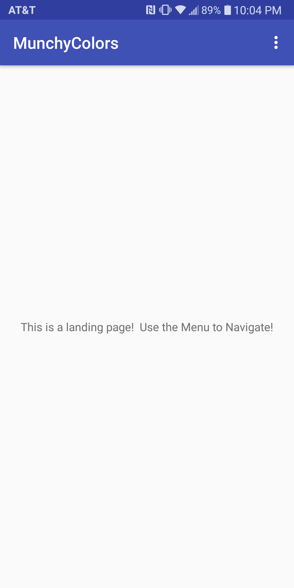
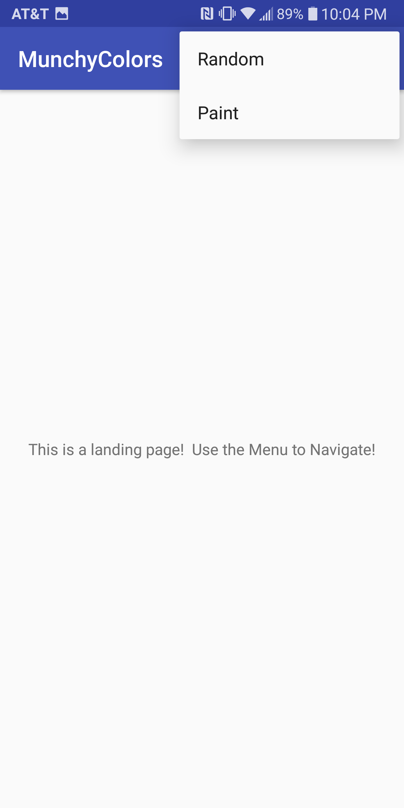
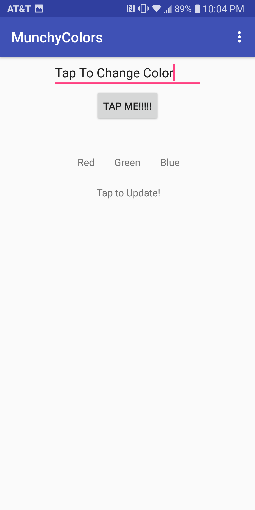
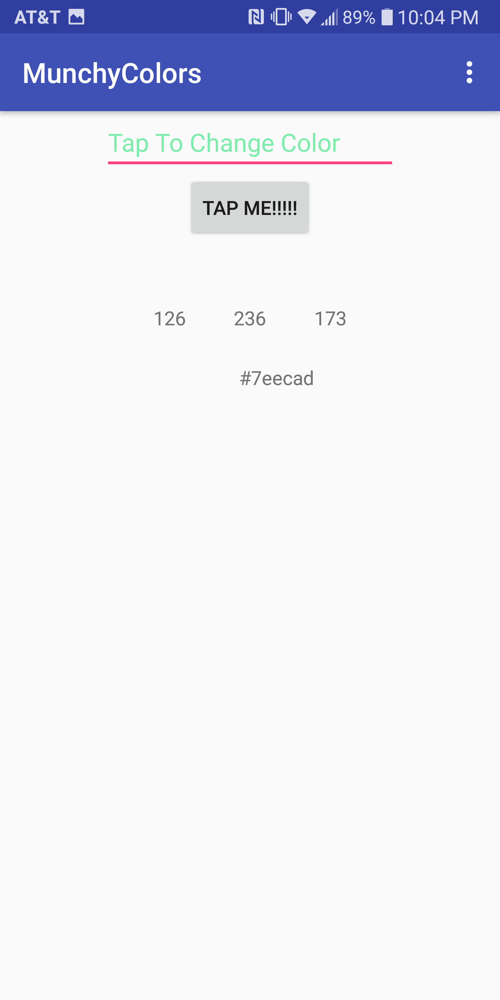
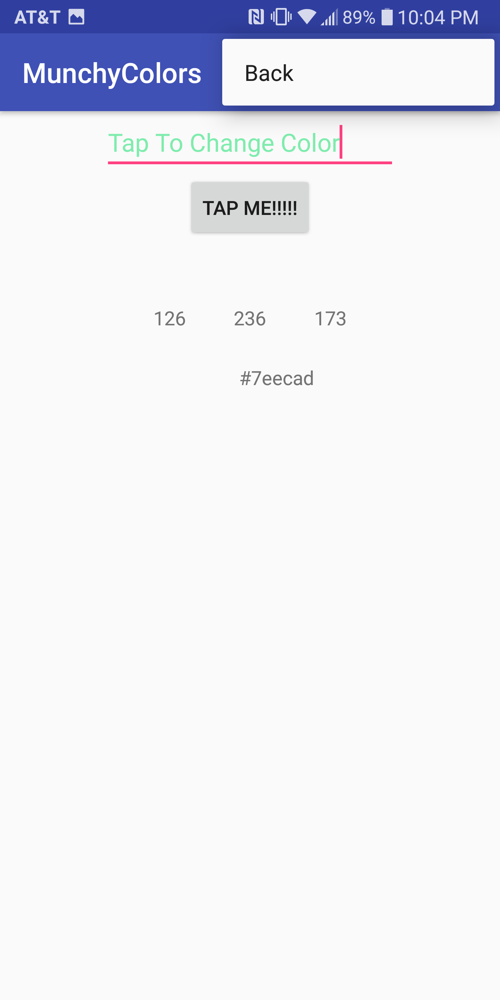
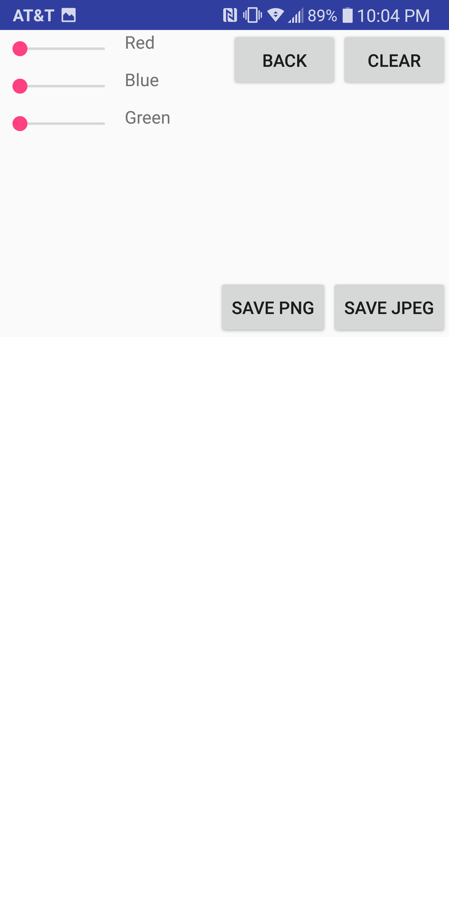
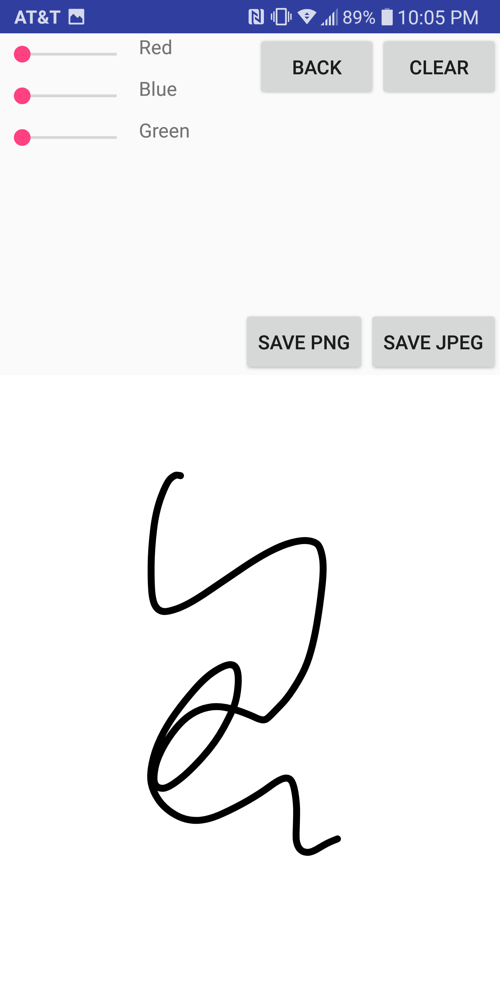
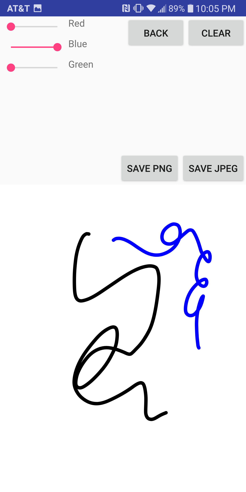
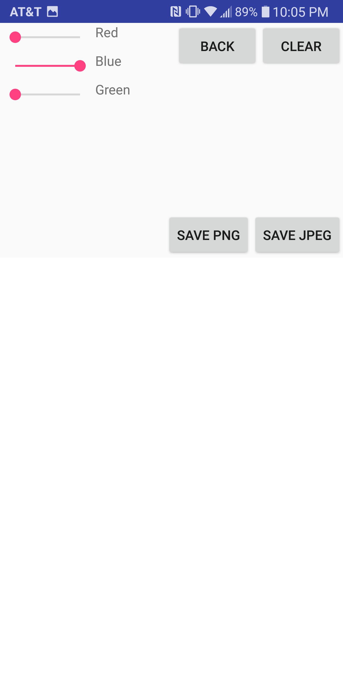

# MunchyPaint

 An App the generates delicious colors and wonderful art!

On a more serious note, this is an app that demonstrates basic ability to use and work with Android development and platform.

 This repo is associated with Wright State University's CEG 4110 Class taught by Dr. Derek Doran.

# Functionality

 This app is broken into 3 'Acitivities' : MainActivity, PaintingMunchies, and RandomMunchies. 

 There are also 2 associated classes to the PaintingMunchies: FingerPath and PaintView. 

 This app is built for Android API version 15.0 and above.

<h4> MainActivity</h4>

 This class / activity acts as a landing page for the app user.  On top of this screen, a drop down menu is accessible to the right.
After selecting the menu, options to go to 'Random' and 'Paint' appear.  Clicking either of these takes the user to the repective activities. 

 Below:  Home page. 

 Below:  Home page with menu displayed. 

 
 

<h4> RandomMunchies </h4>

 This activity allows the user to type in a custom string into the top field, and will change colors randomly when the 'Tap Me!!!' button is pressed.  Additionally, the RGB values are displayed below that, in order of red -> green -> blue.  Below that is the hex representation of the RGB. 

 Finally, a drop down menu can be found in the top right corner and redirects to the MainActivity landing page. 

 Below:  RandomMunchies landing page. 

 Below:  RandomMunchies page after the button press. 

 Below:  RandomMunchies page with menu displayed. 

 
 

<h4> PaintingMunchies </h4>

 This activity allows the user to draw on the screen with different colors, clear, and save the drawing area.  This is done through the supporting classes FingerPath and PaintView. 

 FingerPath Class extends the Android Path Class, which is an object that contains 2D spatial information about the coordinates of the screen the user has touched before releasing from the screen.  The FingerPath Class adds to this the ability to track the color the user had selected when they drew the Path. 

 The PaintView Class uses several packages native to Android's graphics libraries.  The main import is the Canvas class.  The PaintView class creates the literal Canvas that is drawn to the screen.  This is done through drawing each Path to the screen each loop, and these Paths are stored in an ArrayList each time they are made.  This view then becomes availble for use in the layout xml files associated with each activity. 

 Though these are not external libraries, the code for the PaintView and FingerPath are based on a guide by Sylvain Saurel. 

 

 The color selection is done by the use of Seekbars that scale the entire RGB spectrum of colors, so the user has plenty to choose from.  Upon touching the 'Clear' button, the Canavas is wiped and the ArrayList made empty.  Hitting the back button navigates the user back to the main landing page. 

 Below:  PaintingMunchies landing page. 

 Below:  PaintingMunchies with black line drawn - no sliders changed. 

 Below:  PaintingMunchies with blue line drawn - Blue slider moved. 

 Below:  PaintingMunchies cleared - slider still moved. 

 
 

# Getting Started
<h4> Prerequisites </h4>

 There are no external libraries or dependencies for this app.  The only requirement is to have a device with API 15.0 or higher. 

 
<h4> Executable </h4>

 An executable file for the app is found in the repository: MunchyPaint/app/release/ 

 The file just has to be executed from the device after downloaded. 

 
 

# Design

The design of this app is fairly naive.  There were not many moving parts, as the two main parts of the program had different functionalities.  The selection of colors and transitioning from Activity to Activity could have been moved into separate classes that would handle them explicitly.  The PaintingMunchies Activity had some added complexity and design by making use of Canvas and storing all color paths as a structure containing FingerPaths.

 The software is minimalistic and handles most things in single classes and has very little to no interactions from other Activites and classes.  The major dependency the RandomMunchies and PaintingMunchies have are being navigated to via the MainActivity. 

This design is immature, coming from only doing simplistic problem solving programming rather than functional software.

# Author

 Quinn Hirt - Computer Science Undergraduate @ Wright State University 

# Acknowledgements

 Sylvain Saurel: https://medium.com/@ssaurel/learn-to-create-a-paint-application-for-android-5b16968063f8 

